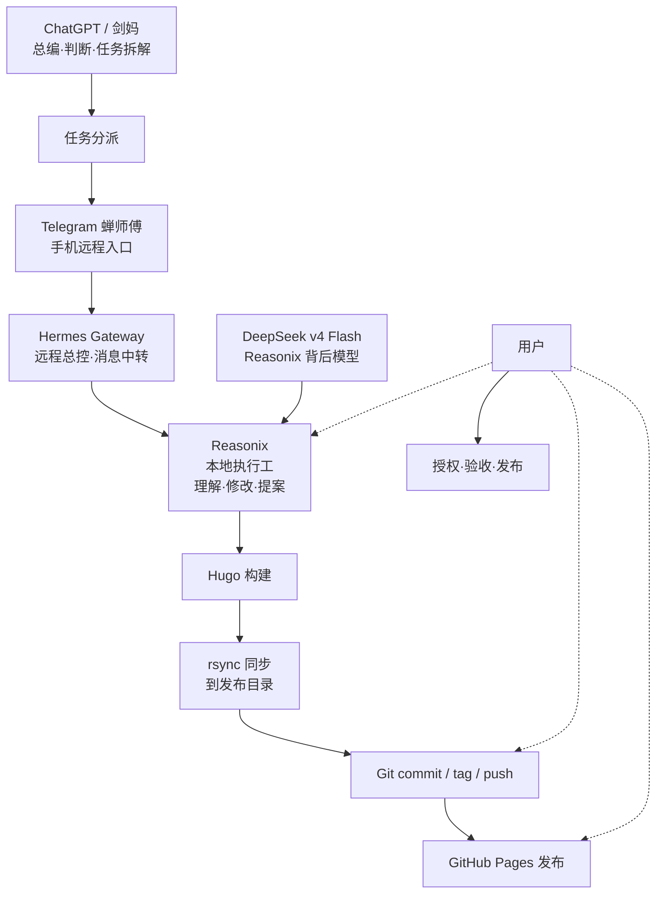

安知生是 angelife 的新站名，也是一个长期知识系统的入口。它不是普通博客，而是一个把旧材料、聊天记录、网页摘录、读书笔记、技术笔记和人生复盘逐步整理为作品的公开空间。

旧站保留在 `/old-site/` 用于追溯，新站会逐步把其中有长期价值的内容整理为更清楚、更短、更适合公开阅读的文章。

## 建站思路

这个新站不是一次性设计出来的，而是在真实的工作流中持续迭代出来的。

建站的原则很简单：**以 AI 辅助整理，以 Hugo 发布作品，以 Git 保护成果，以人掌握方向。**

## 当前工作流

当前的核心工作流是一条精简链路，已经跑通并稳定运行：

```text
ChatGPT / 剑妈（总编·判断·拆解）
    ↓
Telegram 机器人「蝉师傅」（手机远程入口）
    ↓
Hermes Gateway（远程总控·消息中转·terminal 手臂）
    ↓
Reasonix（本地仓库执行工）
    ↓
Hugo 构建 → rsync 同步 → Git commit/tag/push → GitHub Pages
```

每层有明确分工，不越界。

### 角色分工

**ChatGPT / 剑妈**：总编、判断、任务拆解、文章打磨、规则制定。负责决定做什么、做到什么程度、什么标准验收。

**Telegram 机器人「蝉师傅」**：手机远程入口。通过 Telegram 发送指令，触发 Hermes Gateway 执行任务。

**Hermes Gateway**：远程总控、消息中转、terminal 手臂。接收 Telegram 指令，连接 DeepSeek，调度 Reasonix 执行，代跑 shell 命令。Hermes 是总控和 terminal 手臂，不自己 patch 文件或擅自 git add/commit/push。

**Reasonix**：本地仓库执行工。进入项目目录，读取文件，理解项目，修改文件，提出方案。它是真正操作仓库的 AI，也是本页面的作者之一。

**DeepSeek v4 Flash**：Reasonix 和 Hermes 背后的执行模型，承担持续施工。

**Hugo + rsync + GitHub Pages**：静态站生成与发布。本地构建后再同步到发布目录，不依赖 GitHub Actions 在线构建。

**用户（你）**：最终判断、授权、验收、发布责任人。每一次修改、每一次提交、每一次部署，都由人确认后才执行。

### 不是 Obsidian 深度流程

Obsidian 是未来内库方向，但目前尚未深度接入自动化流程。当前网站材料来自旧文章、聊天记录、网页摘录和直接编辑，并非从 Obsidian 自动化处理。

未来方向确实是 Obsidian 作为内库沉淀，但当前工作流以更直接的方式推进。

### 已经稳定的部分

- Hugo 站点基本搭建完成：首页五行栏目、文章页窄栏书页风格、搜索、Kindle 阅读模式均已定型。
- 发布流程固定：本地 Hugo 构建 → rsync → git add/commit/tag/push。
- 文章双版本发布规则：一篇源文件自动生成普通图文版和 Kindle 阅读版。
- Kindle 阅读模式已固化为独立电子书输出，非 CSS 隐藏变体，有验收强制清单。
- 治理文档体系完整：PROJECT_STATUS、BUILD_HANDOFF、AI_WORK_RULES、SITE_STYLE_GUIDE、SITE_CHANGELOG、DAILY_WORK_LOG 每轮修改统一更新。
- 手机远控全链路已定型：Telegram → Hermes → Reasonix → Hugo → rsync → Git。

### 仍在推进的部分

- 评论系统（giscus）未启用，等待 GitHub Discussions 配置。
- Obsidian 内库尚未深度接入自动化流程。
- 更多旧站内容迁移。
- 移动端细节检查。
- Google Groups / Notion 内容整理。

### 工作流关系图



### 维护节奏

这套系统不是一次性工程。

日常收集材料，定期整理为文章，构建后发布。核心是让系统持续运转——只要这条生产线还在运转，旧材料就会继续被整理，新判断会继续沉淀，网站也会继续生长。
