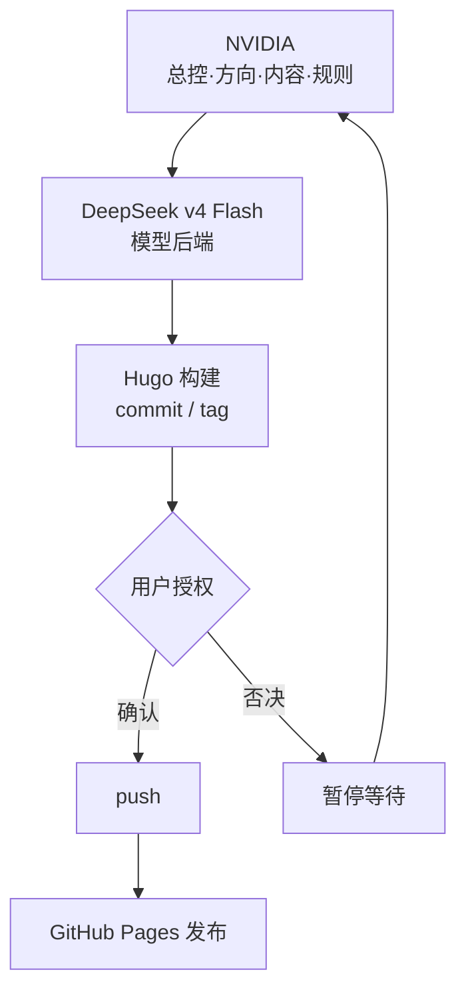

安知生是 angelife 的新站名，也是一个长期知识系统的入口。它不是普通博客，而是一个把旧材料、聊天记录、网页摘录、读书笔记、技术笔记和人生复盘逐步整理为作品的公开空间。

旧站保留在 `/old-site/` 用于追溯，新站会逐步把其中有长期价值的内容整理为更清楚、更短、更适合公开阅读的文章。

## 建站思路

这个新站不是一次性设计出来的，而是在真实的工作流中持续迭代出来的。

建站的原则很简单：**以 AI 辅助整理，以 Hugo 发布作品，以 Git 保护成果，以人掌握方向。**

## 当前工作流（v0.6.42 更新）

当前的核心工作流已经简化为一条精简链路：

```text
NVIDIA（总控：方向决策、内容管理、规则维护）
    ↓
DeepSeek / NVIDIA NIM（模型后端）
    ↓
Hugo 构建 → Git commit / tag → 用户授权 → push → GitHub Pages
```

每层有明确分工，不越界。发布（push）必须经用户确认才能执行。

### 角色分工

**NVIDIA（Docker Hermes）**：总控。方向决策、内容管理、规则维护、全流程执行（生成、写作、Hugo 源文件修改、build、commit、tag）。**push 指令必须等用户确认后才能执行。**

**用户**：最终验收。所有 push/rsync 必须经用户确认后执行，拥有方向否决权。

**MiniMax M2.7（NVIDIA NIM + Minimax 免费练功房）**：NVIDIA 背后的执行模型，承担持续施工。

**Hugo + GitHub Pages**：静态站生成与发布。本地构建后同步到发布目录，不依赖 GitHub Actions 在线构建。

### 已稳定的部分

- Hugo 站点基本搭建完成：首页五行栏目、文章页窄栏书页风格、搜索、Kindle 阅读模式均已定型。
- 发布流程固定：本地 Hugo 构建 → git add/commit/tag → 用户确认 → push。
- 文章双版本发布规则：一篇源文件自动生成普通图文版和 Kindle 阅读版。
- Kindle 阅读模式已固化为独立电子书输出，非 CSS 隐藏变体，有验收强制清单。
- 治理文档体系完整：PROJECT_STATUS、AI_WORK_RULES、AI_EXECUTION_AGENTS、SITE_STYLE_GUIDE、SITE_CHANGELOG、DAILY_WORK_LOG 每轮修改统一更新。
- 容器内 Hugo build 已跑通：/opt/data/hugo v0.162.1。

### 仍在推进的部分

- 评论系统（giscus）未启用，等待 GitHub Discussions 配置。
- 更多旧站内容迁移。
- 移动端细节检查。
- Google Groups / Notion 内容整理。

### 工作流关系图



### 维护节奏

这套系统不是一次性工程。

日常收集材料，定期整理为文章，构建后发布。核心是让系统持续运转——只要这条生产线还在运转，旧材料就会继续被整理，新判断会继续沉淀，网站也会继续生长。