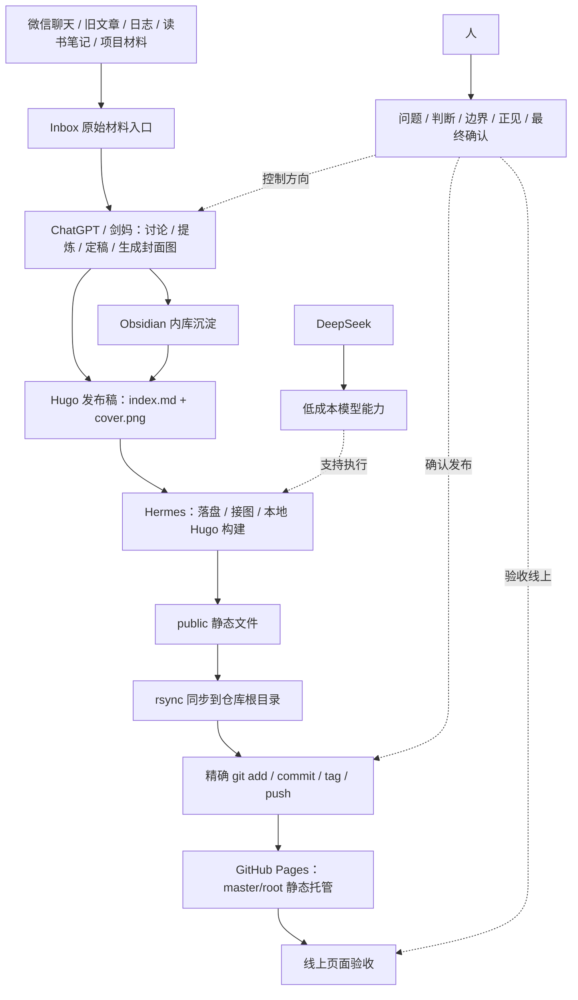

---
title: "关于安知生"
date: 2026-05-28
draft: false
description: "安知生是 angelife 的长期知识系统入口，用 AI 整理材料，用 Hugo 发布作品，用 Git 保护成果，用人的判断守住方向。"
showToc: true
tocOpen: false
---

# 关于安知生

安知生是 angelife 的新站名，也是一个长期知识系统的入口。

它不是普通博客，也不是一次性作品集，而是把旧材料、聊天记录、网页摘录、读书笔记、技术笔记、项目日志和人生复盘，逐步整理成公开作品的长期系统。

本站的核心方向是：

> 以 AI 整理材料，以 Obsidian 沉淀知识，以 Hugo 发布作品，以 Git 保护成果，以人的判断与不失正见统一方向。

旧站作为历史版本保留在 `/old-site/`，用于追溯早期材料。新站会逐步把其中有长期价值的内容重新整理为更清楚、更短、更适合公开阅读的文章。

## 这个新站是怎么做出来的

这个新站不是一次性设计出来的，而是由旧材料、AI 协作、Obsidian 内库、Hugo 外站、Git 版本管理和人工判断，一点点整理出来的。

早期材料已经积累很多年。里面有文章、日志、项目记录、历史材料和一些早期判断。它们不是没有价值，而是太散、太旧、太难读。很多内容还停留在早期网页、旧手册、聊天记录和临时笔记里，像一座没有重新整理过的仓库。

这次重做网站，真正目标不是换一个外壳，而是把旧材料重新变成可阅读、可检索、可继续生长的作品。

## 当前 AI 协作分工

这套系统不是“一个 AI 替人建站”，而是“人把多个 AI 和工具组织成一个工作流”。

现在的分工已经更新为：

### ChatGPT / 剑妈：总控、主编和内容生成

ChatGPT，也就是剑妈，负责：

- 观点讨论；
- 问题提炼；
- 文章正文定稿；
- 标题、slug、description 和 front matter；
- 封面图真实生成；
- alt text、caption；
- Hugo 目标路径；
- Hermes 执行任务说明；
- 发布前验收标准；
- 工作流规则维护。

文章和图片原则上先在剑妈这里生成。
只有当文章正文、封面图、alt、caption 和路径都确定以后，才交给执行代理落盘和发布。

剑妈负责的是方向、结构、表达、风格和判断，不负责直接操作本地 Git 仓库。

### Hermes / Hermers：低成本执行代理

Hermes / Hermers 负责：

- 接收剑妈已经定稿的文章；
- 接收剑妈已经生成的封面图；
- 写入 Hugo 指定路径；
- 接入 front matter；
- 执行 Hugo 本地构建；
- rsync 静态产物到仓库根目录；
- 精确 git add；
- commit；
- tag；
- push；
- 返回最短收工报告。

Hermes 不是军师，不是主编，不是写作代理，也不是排障研究员。

它不负责重新写文章，不负责生成图片，不负责改写正文，不负责长篇解释，不负责探索式排障。遇到异常时，应该立即停止，等待人和剑妈重新拆分任务。

一句话：

> 剑妈定战略，Hermes 拉磨；Hermes 不许悟道。

### DeepSeek：低成本模型能力

DeepSeek 可以作为 Hermes 背后的低成本模型能力，用于执行、整理和辅助操作。

但 DeepSeek 不是最终主编，不负责最终判断。
真正的文章风格、价值取舍、发布边界和验收标准，仍然由人和剑妈控制。

### 人：最终判断和边界

人负责最后判断。

AI 可以加速整理、写作、生成和发布，但不能替人决定方向、边界和取舍。

人负责：

- 提出真正的问题；
- 判断观点是否成立；
- 决定什么可以公开；
- 决定什么不能发布；
- 确认文章是否符合本站风格；
- 确认是否提交、打 tag、推送；
- 守住“不失正见”。

## 当前内容生产流程

现在一篇文章的标准流程是：

1. 在微信、聊天、阅读或现实经验中出现原始观点；
2. 人把碎片和问题抛给剑妈；
3. 剑妈先讨论、提炼、合并、压缩问题；
4. 观点成熟后，剑妈整理为可发布文章；
5. 剑妈生成标题、slug、description、front matter、标签、分类；
6. 剑妈生成封面图或至少给出封面图素材状态；
7. 剑妈生成 alt text、caption 和目标路径；
8. 剑妈打包为 Hugo 可落盘文件；
9. Hermes 只负责放文件、接图、构建、rsync、提交、打 tag 和推送；
10. 人最后验收线上页面。

这套流程的重点是：文章和图片先在剑妈这里完成，Hermes 只做低成本执行。

这样可以减少 token 浪费，也可以避免执行代理一边探索仓库、一边重写内容、一边改坏风格。

## 为什么选择 Obsidian

这个新站不是只靠 Hugo 完成的。

Hugo 适合发布，Obsidian 适合沉淀。一个是外站，一个是内库。外站给别人看，内库给自己长期整理、连接和复盘。

选择 Obsidian，首先是因为它使用 Markdown。文章、笔记和草稿都是普通文本，不被某个平台锁死。以后要迁移到 Hugo、Git、其他编辑器或新的知识系统，都比较容易。

第二，它适合长期积累。旧文章、聊天记录、读书笔记、网页摘录、项目记录和临时灵感，都可以先进入 Obsidian。它们不一定马上发布，但可以先被保存、分类和连接起来。

第三，它适合建立关系。很多想法单独看只是碎片，但放在双链和标签系统里，就能慢慢连成主题。一个观点可以连接到旧经历，一篇文章可以连接到一本书，一个项目可以连接到一组长期问题。

第四，它适合和 AI 配合。AI 可以先帮助材料分类、摘要、提炼和生成初稿，人再把真正有价值的部分沉入 Obsidian。这样 AI 就不只是一次性聊天工具，而是进入了长期知识生产线。

第五，它和 Hugo 很自然地衔接。Obsidian 里成熟的内容，可以整理成发布稿，再进入 Hugo。Hugo 负责生成静态网站，Git 负责保存版本，Obsidian 负责保留更完整的内部思考过程。

所以，这个系统的分工是：

- Obsidian 是内在知识库；
- Hugo 是公开发布站；
- Git 是版本记忆；
- AI 是整理和生成助手；
- 人负责方向、判断和边界。

## Hugo 发布方式

本站采用固定发布流程：

```text
本地 Hugo 构建
→ rsync 静态产物到仓库根目录
→ 精确 git add
→ commit
→ tag
→ push commit + tag
→ GitHub Pages 从 master/root 托管静态文件
```

GitHub Pages 设置应保持：

```text
Source: Deploy from a branch
Branch: master
Folder: / root
```

本站不采用 GitHub Actions 在线构建 Hugo。

原因很简单：线上构建容易把本地规则、静态产物、Hugo 源文件、发布路径和 workflow 混在一起。本站要求本地先生成完整静态文件，再把静态结果同步到仓库根目录，GitHub Pages 只负责托管现成页面。

固定禁止事项：

- 禁止 `git add .`；
- 禁止提交 `_incoming/`；
- 禁止恢复 `.github/workflows/hugo.yml` 在线构建；
- 禁止 GitHub Actions 在线构建 Hugo；
- 禁止 rsync 误删 `.git/`、`.github/`、`hugo-site/`、治理文档和微信认证文件。

## rsync 安全规则

本项目的 rsync 不是随便同步。

必须使用带保护的同步方式，避免 `--delete` 把仓库治理文件、Hugo 源文件、Git 元数据和认证文件扫掉。

核心原则是：

- `hugo-site/public/` 是源；
- 仓库根目录是静态站发布目录；
- 但仓库根目录还保留治理文件和源文件；
- 所以 rsync 必须排除关键目录和文件。

尤其要保护：

- `.git/`
- `.github/`
- `hugo-site/`
- `_incoming/`
- `docs/`
- `PROJECT_STATUS.md`
- `BUILD_HANDOFF.md`
- `AI_WORK_RULES.md`
- `HERMES_COST_RULES.md`
- `SITE_STYLE_GUIDE.md`
- `SITE_CHANGELOG.md`
- `DAILY_WORK_LOG.md`
- `README.md`
- `LICENSE`
- `0847745cb78663855a3a1732c9c6a130.txt`

## 微信认证文件保护

本站根目录有一个微信认证文件：

```text
0847745cb78663855a3a1732c9c6a130.txt
```

文件内容必须是：

```text
01413348ab0d5b381a2e7099ba2600ed57ad50d3
```

源文件应保留在：

```text
hugo-site/static/0847745cb78663855a3a1732c9c6a130.txt
```

构建和 rsync 后，网站根目录也必须保留：

```text
0847745cb78663855a3a1732c9c6a130.txt
```

线上地址必须可访问：

```text
https://angelife.github.io/0847745cb78663855a3a1732c9c6a130.txt
```

这个文件相当于网站“地契”，不能被清洁构建、rsync、重构、版本更新或发布流程误删。

## AI 协作也要维护

AI 本身也需要管理。

不能每次都随便问一句“帮我改网站”。那样很容易把目录改乱，把风格写散，把旧文改坏，也会烧掉大量 token。

现在项目里必须长期遵守：

- `PROJECT_STATUS.md`
- `BUILD_HANDOFF.md`
- `AI_WORK_RULES.md`
- `HERMES_COST_RULES.md`
- `SITE_STYLE_GUIDE.md`
- `SITE_CHANGELOG.md`
- `DAILY_WORK_LOG.md`
- `hugo-site/data/changelog.yaml`

任何 AI 接手前，都应该先读规则，确认当前版本、当前流程、禁止事项和未完成任务。

其中 `HERMES_COST_RULES.md` 是专门给 Hermes / Hermers 的缰绳。它的核心作用是防止执行代理进入探索式排障、长篇解释、反复读文件和重写文章，从而造成 token 浪费。

## 最小维护节奏

这套系统可以按一个简单节奏运行。

每天：收集材料，进入 Inbox。
每周：清理 Inbox，把有价值的材料沉入 Obsidian。
每月：从 Obsidian 里挑出成熟主题，整理成一到几篇 Hugo 文章。
每次发布前：确认文章、图片、路径、front matter 和验收标准。
每次发布中：本地 Hugo 构建，rsync 到根目录，精确 git add，commit，tag，push。
每次发布后：确认线上页面、首页列表、图片、RSS、sitemap 和微信认证文件是否正常。

真正重要的不是一次写很多文章，而是让系统持续运转。

只要这条生产线还在，旧材料就会继续被整理，新判断会继续沉淀，网站也会继续生长。

## 协作流程关系图



## 最后

安知生不是为了追逐每天更新而存在。

它的真正目标，是把长期经验整理成可复用的判断，把聊天里的闪念变成文章，把旧材料变成新作品，把 AI 工具变成一套可控的生产线，而不是让工具反过来吞掉人。

AI 可以生成文章，AI 可以生成图片，AI 可以执行发布。

但问题从哪里来，方向怎么定，什么能公开，什么不能公开，什么钱能赚，什么钱不能赚，什么是事实，什么是幻觉，什么是短期流量，什么是不失正见——这些仍然必须由人判断。

所以本站的底层原则还是那句话：

> 工具可以借，判断不能借。
> 能力可以放大，骨头不能外包。
> AI 可以帮忙做事，但不能替人做人。
