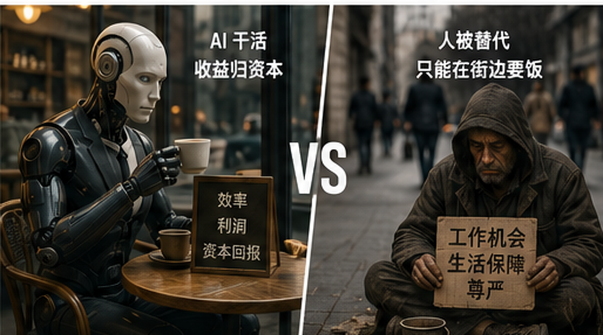
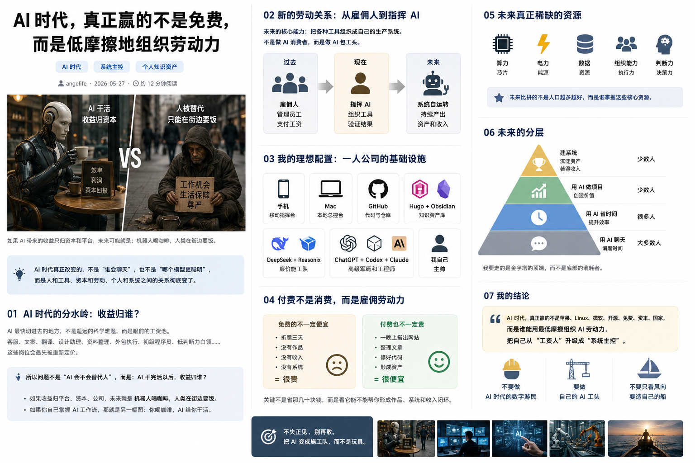

## 机器人喝咖啡，人类要饭：AI 收益归谁？

今天聊到最后，最不能漏掉的其实是那幅图：**机器人坐着喝咖啡，人类在街边要饭。**

这不是简单的科幻笑话，而是 AI 时代最残酷的问题：**AI 干完活以后，收益归谁？**

如果收益归平台、资本和公司，那就是机器人喝咖啡，人类要饭。机器替人干活以后，享福的不一定是人，可能是拥有机器、算力、数据和平台的人。

如果你自己掌握 AI 工作流，那画面就会反过来：你喝咖啡，AI 给你干活。

这就是分水岭。

这个隐喻也让我重新理解那张著名封面。2017 年，《纽约客》的 R. Kikuo Johnson 画过一幅名为《Tech Support》的封面，画面里机器人在现代街区里行走、消费，而人类反而变成街边乞讨者。那幅图最狠的地方，不是说机器人一定会统治人类，而是说：**如果生产工具属于资本，普通人就可能从劳动者退化成被施舍者。**

所以 AI 时代真正的问题，不是“AI 会不会替代人”，而是：

> **AI 替人干活之后，收益归谁？**

## AI 的分水岭：收益归谁？

过去我们总以为，技术进步是为了让人类更轻松。AI 最早听起来也是奔着解决癌症、科学发现、无人驾驶、提高生产力去的。

但现实很快露出另一面：资本发现，AI 最快能切进去的地方，不是遥远的科学难题，而是眼前的工资池。

客服、文案、翻译、设计助理、资料整理、外包执行、初级程序员、低判断力白领，这些岗位会最先被重新定价。

也就是说，AI 原本许诺消灭痛苦，后来先消灭了岗位议价权。

所以问题不是“AI 会不会替代人”，而是：

> **AI 干完活以后，收益归谁？**

如果收益归资本，就是机器上桌喝咖啡，人类下桌要饭。

如果你自己掌握 AI，就是你上桌喝咖啡，AI 下场施工。

## 普通人的旧路线正在变窄

我今天越来越确认：普通人未来最大的风险，不是不会某一门技术，而是只有工资，没有资产；只有经验，没有系统；只有勤奋，没有 AI 工具链。

以前的主流人生路线是：

> 读书 → 做题 → 进城 → 找工作 → 996 → 房贷或租金 → 教育、医疗、养老、生育压力 → 中年被新技术重新定价

这条路以前叫上升通道，现在越来越像一条传送带。

AI 时代真正值钱的能力，是把各种工具组织成自己的生产系统。不是做 AI 消费者，而是做 AI 包工头。

## 免费不一定便宜，付费不一定贵

我以前有一个很强的观念：免费最好，开源最好，能白嫖就白嫖。

现在看，这个观念要改。

如果一个免费工具让你折腾三天，没有作品，没有收入，没有系统，那它很贵。

如果一个付费 AI 帮你一晚上搭出网站、整理文章、修好代码、形成资产，那它很便宜。

AI 时代，付费不是消费，很多时候是雇佣数字劳动力。关键不是省那几十块钱，而是看它能不能帮你形成作品、系统和收入闭环。

真正的账不能只算 token 钱，而要算：

- 少走多少弯路；
- 节省多少时间；
- 是否形成可展示作品；
- 是否形成可复用流程；
- 是否能带来收入或长期资产。

## Linux、微软、苹果：三条路线重新归位

我曾经很推崇 Linux、开源、免费、自由软件。这是一种理想主义路线。它代表自由、可控、透明和工程精神。

但现实是，很多时候你会被环境、依赖、驱动、显卡、部署、本地模型这些东西耗死。理想很高，产出很慢。

微软是另一条路。它代表企业、办公、兼容、商业软件和旧世界的工程秩序。它养活了大量程序员，也制造了大量臃肿、历史包袱和低效体验。它适合企业机器，不一定适合一个人的 AI 生产线。

苹果则是第三条路。苹果并不代表道德上的胜利，它也封闭，也贵，也限制多。但 AI 时代，苹果代表的低摩擦、稳定、设备协同、残值和易用性，突然变得非常值钱。

所以不是“苹果党赢了”，而是：

> **低摩擦工作流赢了。**

Mac 和 iPhone 适合做个人主控台；Linux 适合做后端、服务器、自动化和工地；AI 适合做数字员工。真正高级的用法不是信仰某一个系统，而是把它们放在正确的位置上。

## 我的理想配置：一人公司的基础设施

我的理想配置应该是：

- 手机：移动指挥台；
- Mac：本地总控台；
- GitHub：仓库；
- Hugo 和 Obsidian：知识资产库；
- DeepSeek、Reasonix：廉价施工队；
- ChatGPT、Codex、Claude：高级军师和工程师；
- 我自己：主帅。

这不是玩工具，而是在搭一人公司的基础设施。

以前我容易犯的错误是：研究工具太多，真正交付太少。今天试 Gemini，明天试 DeepSeek，后天研究 Claude，再去找免费额度。看似很努力，其实是在做 AI 评测员。

现在应该改成：

> 选定工具 → 拆任务 → 交给 AI → 自己验收 → 发布作品 → 形成资产

这才是一人公司的基本雏形。

## 未来稀缺的不只是技术，而是系统主控权

更大的层面看，未来真正稀缺的东西也变了。

不是人口越多越好，而是年轻、可训练、能消费、能承担系统成本的人口才重要。不是谁口号喊得响，而是谁掌握算力、电力、芯片、数据、组织能力和判断力。

资本会继续冲向工资池，国家会被迫兜底，传统中产路线会被压缩，所谓“人民”的旧叙事也会受到冲击。

一个人如果没有组织力、判断力、产权和生产力，就很容易从主体变成流量、票仓、韭菜和耗材。

所以未来最重要的问题不是“人民万岁”，而是：

> **谁还能保持主体性，谁才真正像个人。**

## angelife：把个人网站做成样板间

对我来说，答案越来越清楚。

我不应该再把自己卖成一份工资，也不应该沉迷于工具比较。我要做的是把自己的 angelife 网站做成样板间：证明一个人用老 Mac、手机、AI、GitHub、Hugo、Obsidian，可以把旧资料、文章、知识库、历史内容整理成一个长期生长的网站系统。

这个样板间做好以后，它就不只是个人网站，而是一套方法论：

- 如何用 AI 重建个人网站；
- 如何把混乱资料整理成知识资产；
- 如何用低成本工具搭一人公司；
- 如何让 AI 变成施工队，而不是玩具。

未来真正的分层，不是会不会用 AI，而是：

- 有人用 AI 聊天；
- 有人用 AI 省时间；
- 有人用 AI 做项目；
- 少数人用 AI 建系统、沉淀资产、获得收入。

我要走的是最后一条。

## 结论

AI 时代，真正赢的不是苹果、Linux、微软、开源、免费、资本、国家，而是谁能用最低摩擦组织 AI 劳动力，把自己从“工资人”升级成“系统主控”。

不要做 AI 时代的数字游民。

要做自己的 AI 工头。

不要只看风向。

要造自己的船。

不失正见，别再散。

## 参考

- [R. Kikuo Johnson, “Tech Support”, The New Yorker, 2017-10-16](https://www.newyorker.com/culture/cover-story/cover-story-2017-10-23)
- [R. Kikuo Johnson — Tech Support](https://www.rkikuojohnson.com/tech-support)
